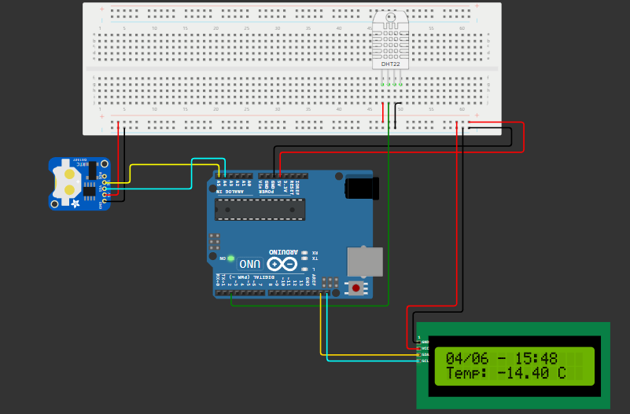

# Projeto de Monitoramento da Eutrofização com Arduino

## Descrição do Projeto
Este projeto foi desenvolvido como parte de um desafio educacional para monitorar e analisar os efeitos da eutrofização em corpos d'água. Utilizamos um sistema baseado em Arduino para medir a temperatura da água, já que o simulador não oferece sensores de oxigenação disponíveis. O objetivo principal é fornecer dados em tempo real que podem ser usados para entender melhor a relação entre a eutrofização e as variações de temperatura da água.

## Componentes Utilizados
- **Arduino UNO**
- **Sensor de Temperatura DHT22**: Utilizado para medir a temperatura da água (simulada).
- **Display LCD I2C 16x2**: Para exibir a data, hora e temperatura medida.
- **RTC DS3231**: Para manter o registro preciso do tempo.
- **Protoboard e Jumpers**: Para a montagem do circuito.

## Funcionalidades
- **Medição de Temperatura**: Mede a temperatura da água a cada 2 segundos usando o sensor DHT22.
- **Exibição de Dados**: Mostra a data, hora e temperatura atual no display LCD.
- **Armazenamento de Dados**: Armazena até 10 leituras de temperatura e seus respectivos horários.
- **Registro de Horário**: Utiliza o RTC DS3231 para manter a precisão dos registros de tempo.
- **Serial Monitor**: Exibe todas as leituras de temperatura e horários no Serial Monitor.

## Como Funciona
1. **Inicialização**: Na configuração inicial, o sensor DHT22, o display LCD e o RTC DS3231 são inicializados. O RTC é ajustado para a hora de compilação, se necessário.
2. **Medição e Exibição**: No loop principal, a temperatura é lida do sensor DHT22 e exibida no display LCD junto com a data e hora atual.
3. **Armazenamento de Dados**: Se a hora atual for diferente da última hora registrada, a leitura de temperatura e o horário são armazenados em um array.
4. **Serial Monitor**: Todas as leituras armazenadas são impressas no Serial Monitor para monitoramento e análise.

## Como Executar o Projeto
1. **Montagem do Circuito**:
   - Conecte o sensor DHT22 ao pino 2 do Arduino.
   - Conecte o display LCD I2C ao barramento I2C do Arduino.
   - Conecte o módulo RTC DS3231 ao barramento I2C do Arduino.
2. **Carregamento do Código**:
   - Conecte o Arduino ao computador e abra o Arduino IDE.
   - Copie e cole o código fonte acima no editor.
   - Selecione a placa e a porta correta no menu Ferramentas.
   - Carregue o código para o Arduino.
3. **Visualização dos Dados**:
   - Abra o Serial Monitor no Arduino IDE para visualizar os dados armazenados.
   - Observe os dados de temperatura e horário sendo exibidos no display LCD.

## Fotos do Projeto

*Legenda: Circuito montado com Arduino, sensor DHT22, display LCD e RTC DS3231.*

## Observações
- Este projeto usa a temperatura da água como um indicador indireto para monitorar os efeitos da eutrofização, devido à limitação dos sensores disponíveis no simulador.
- O projeto pode ser estendido para incluir outros parâmetros relevantes para a eutrofização, como pH e oxigênio dissolvido, utilizando sensores apropriados em um ambiente real.

## Licença
Este projeto é de código aberto e pode ser usado livremente para fins educacionais e de pesquisa. Atribuição é apreciada.
